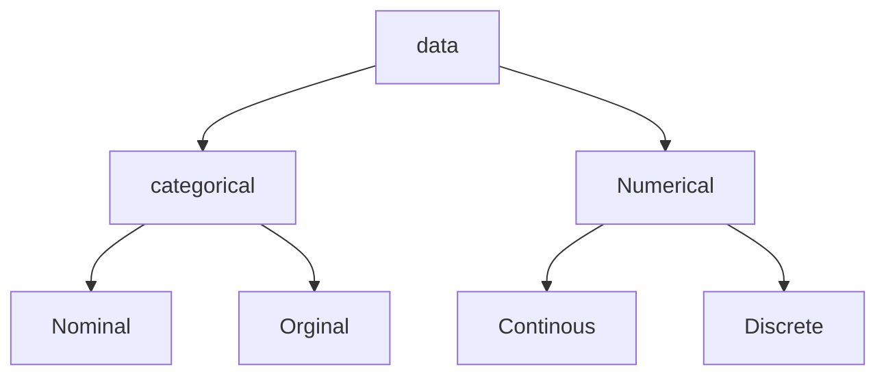

## Introduction and types of Data - Basic definitions

### What is Statistics?  

  - **Definition**: Statistics is the art of learning from data. It is concerned with the collection of data, their subsequent description, and their analysis,  which often leads to the **drawing of conclusions**. 

 ### Major branches of statistics

1. **Description**  

   - **Definition**: The part of statistics concerned with the description and summarization of data is called *descriptive statistics*.  

    > Descriptive statistics can be performed either on a sample or a population.

2. **Inference **

   - **Definition**: The part of statistics concerned with the drawing of conclusions from data is called inferential statistics.  To be able to conclude the data, we must take  into account the <u>possibility of chance</u>- introduction to  *probability*

- Examples

  - Suppose we are interested in knowing  
    - The percentage of all students in India who have passed their  Class 12 examS and study engineering.  
    - The prices of all houses in Tamil Nadu.  
    - The total sales of all cars in India in the year 2019. 
    - The age distribution of people who visit a city Mall in a  particular month.  

### Population and Sample

- The total collection of all the elements that we are interested in is called a **population**.
- A subgroup of the population that will be studied in detail is called a **sample**. 

### Purpose of Statistical analysis

- If the purpose of the analysis is to examine and explore information for its own intrinsic interest only, the study is **descriptive**.
- If the information is obtained from a sample of a population and the purpose of the study is to use that information to conclude the population, the study is **inferential**. 

 

## Introduction and types of Data - Understanding data

- **Data** is information that is all around us, whether we are formally doing statistical analysis or not; all of us are either creating data or contributing towards the collection of data or we are collecting data ourselves.

### What is data?

- To learn something, we need to collect data. 
- **Definition**DS
  - Data are the facts and figures collected, analysed, and summarized for presentation and interpretation. 
    - Statistics relies on data, information that is around us.

### Why do we collect data?

- Interested knowing in the characteristics of some group or groups of people, places, things, or events. 
- Example: TO know about temperatures in a particular month in Chennai, India. 
- Example: TO know about the marks obtained by students in their Class 12. 
- To know how many people like a new song/product/video- collected through comments. 

### Data Collection

- Data available: published data. eg, data.gov .in
- Data not available: need to collect, generate data.

> We assume data is available and our objective is to do a statistical analysis of available data

### Unstructured and structured data

- For the information in a database to be useful, we must know the context of the numbers and text it holds.
- When they are scattered about with no structure, the information is of very little use.
- <u>Hence, we need to organize data</u>

### Dataset 

- A structured collection of data.
- it  is a collection of values-could be numbers, names, roll numbers.

### Variables and case

| Names | fees paid | Marks |
| ----- | --------- | ----- |
| A     | 12        | 75    |
| B     | 12        | 90    |
| C     | 12        | 80    |
| d     | 12        | 68    |

- **Case** ( observation): A unit from which data are collected

- **Variable**: 

  - **Intuitive**: A variable is that "varies" 
  - **Formally**: A characteristic or attribute that varies across all  units.  

- In our school data set: 

  - Case: each student 
  - Variable: Name. marks obtained. Board etc. 

- Rows represent cases: for each case. same attribute is recorded 

- Columns represent variables: For each variables. same type Of value for each case is recorded. 

  > We have organised data in a spreadsheet into a table
  >
  > - Each variable must have its own column
  > - Each observation must have its own row.

## Introduction and Types of Data - Classification of data

### Categorical and numerical

#### Categorical data

> - Also called qualitive variables 
> - identify group membership 
> - Eg Gender, School Board, Blood Group, Role, Jersey no. 

**Categorical variable**s: Variables which should not be treated like numbers (as in mathematics), and whose values come from a list of possibilities. 

- **Nominal variable:** A categorical variable where the categories do not have a natural ordering (e.g. gender, ethnicity, country). 
- **Ordinal variable**: A categorical variable where the categories have a natural ordering (e.g. age group, income level, educational status).

#### Numerical data

> - Also called quantitative variables 
> - Describe the numerical properties of case
> - Measurable quantity
> - Eg Marks, height, weight,Highest score.

**Numerical variables**: Numbers which should be treated as they usually are in mathematics. 

- **For example**, age and weight would be considered numerical variables, while phone number and ZIP code would not be considered numerical variables. There are 2 types of numerical variables: 
  - **Continuous variable**: A numerical variable that can take values on a continuous scale (e.g. age, weight). 
  - **Discrete** **variable**: A numerical variable that only takes on whole numbers (e.g. number of visits).

